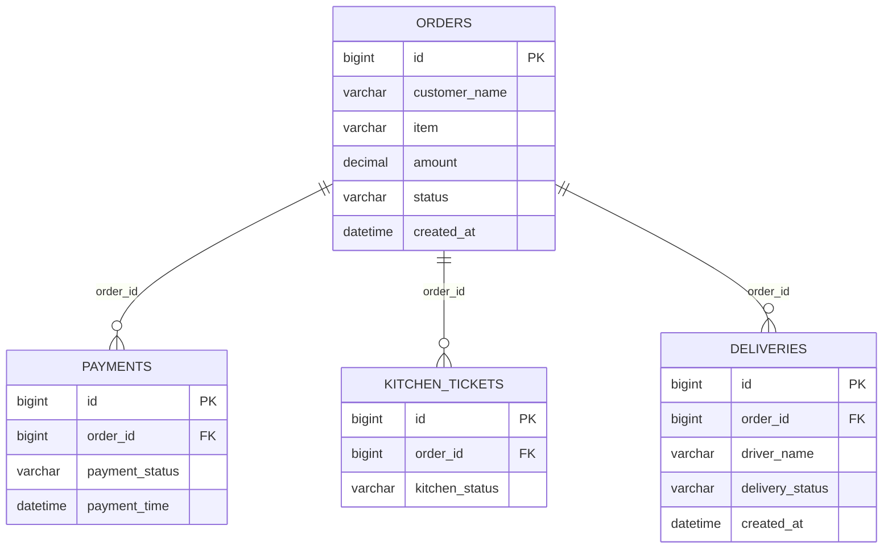
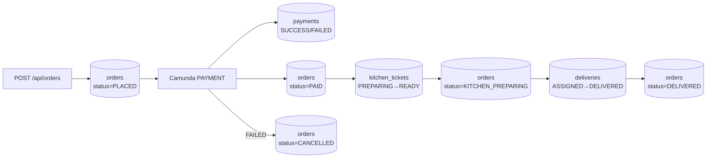

# Database Design
## Online Food Order Processing System

**Database:** MySQL  
**Schema name:** `food_order_db`  
**Connection:** `jdbc:mysql://localhost:3306/food_order_db`  
**Schema management:** Hibernate `ddl-auto=update` (tables auto-created on startup)

All four microservices share the same database. Each service owns its tables. Cross-service references use `order_id` as a **logical foreign key** (not enforced by JPA `@ManyToOne`).

---

## 1. Entity-Relationship Diagram



**Note:** Camunda also creates `ACT_*` tables in the same database for process engine metadata. These are managed by Camunda, not application code.

---

## 2. Table Definitions

### 2.1 `orders` (Order Service)

Primary order record. Source of truth for order status displayed in the UI.

| Column | Data Type | Constraints | Description |
|--------|-----------|-------------|-------------|
| `id` | `BIGINT` | PK, AUTO_INCREMENT | Order identifier |
| `customer_name` | `VARCHAR(100)` | nullable | Customer display name |
| `item` | `VARCHAR(100)` | nullable | Item description (may list multiple items) |
| `amount` | `DECIMAL(10,2)` | nullable | Order total in USD |
| `status` | `VARCHAR(50)` | nullable | Current lifecycle status |
| `created_at` | `DATETIME` | auto (DB default) | Timestamp when order was created |

**Entity:** `com.example.foodorder.order.model.Order`  
**Service:** order-service (port 8081)

**Status lifecycle:**
```
PLACED → PAID → KITCHEN_PREPARING → OUT_FOR_DELIVERY → DELIVERED
PLACED → CANCELLED  (payment failure)
```

---

### 2.2 `payments` (Payment Service)

Payment attempt record per order.

| Column | Data Type | Constraints | Description |
|--------|-----------|-------------|-------------|
| `id` | `BIGINT` | PK, AUTO_INCREMENT | Payment record ID |
| `order_id` | `BIGINT` | nullable | References `orders.id` (logical FK) |
| `payment_status` | `VARCHAR(50)` | nullable | `SUCCESS` or `FAILED` |
| `payment_time` | `DATETIME` | auto (DB default) | Timestamp of payment processing |

**Entity:** `com.example.foodorder.payment.model.Payment`  
**Service:** payment-service (port 8082)

**Business rule:** Payment fails when `amount > 100.00`.

---

### 2.3 `kitchen_tickets` (Kitchen Service)

Kitchen preparation ticket per order.

| Column | Data Type | Constraints | Description |
|--------|-----------|-------------|-------------|
| `id` | `BIGINT` | PK, AUTO_INCREMENT | Ticket ID |
| `order_id` | `BIGINT` | nullable | References `orders.id` (logical FK) |
| `kitchen_status` | `VARCHAR(50)` | nullable | `PREPARING` → `READY` |

**Entity:** `com.example.foodorder.kitchen.model.KitchenTicket`  
**Service:** kitchen-service (port 8083)

**Simulation:** 2-second delay between `PREPARING` and `READY`.

---

### 2.4 `deliveries` (Delivery Service)

Delivery assignment and completion record.

| Column | Data Type | Constraints | Description |
|--------|-----------|-------------|-------------|
| `id` | `BIGINT` | PK, AUTO_INCREMENT | Delivery record ID |
| `order_id` | `BIGINT` | NOT NULL | References `orders.id` (logical FK) |
| `driver_name` | `VARCHAR(100)` | nullable | Assigned driver name |
| `delivery_status` | `VARCHAR(50)` | nullable | `ASSIGNED` → `DELIVERED` |
| `created_at` | `DATETIME` | set on insert (`@PrePersist`) | Record creation time |

**Entity:** `com.example.foodorder.delivery.model.Delivery`  
**Service:** delivery-service (port 8084)

**Simulation:** 3-second delay between `ASSIGNED` and `DELIVERED`.  
**Drivers:** Randomly chosen from: Ravi Kumar, Suresh Babu, Arun Raj, Karthik Selvan, Dinesh Patel.

---

## 3. Relationships

| From | To | Cardinality | Join | Enforced |
|------|----|-------------|------|----------|
| `payments.order_id` | `orders.id` | Many-to-One | Logical | No (JPA FK constraint) |
| `kitchen_tickets.order_id` | `orders.id` | Many-to-One | Logical | No |
| `deliveries.order_id` | `orders.id` | Many-to-One | Logical | No |

Each order typically has:
- 1 payment record
- 1 kitchen ticket
- 1 delivery record

(On payment failure, kitchen and delivery records are not created.)

---

## 4. Camunda Tables (Auto-Created)

Camunda 7 creates its own schema in `food_order_db` when order-service starts:

| Table prefix | Purpose |
|--------------|---------|
| `ACT_RE_*` | Repository (process definitions) |
| `ACT_RU_*` | Runtime (active process instances) |
| `ACT_HI_*` | History (completed instances) |
| `ACT_GE_*` | General (properties, byte arrays) |

Managed by Camunda with `camunda.bpm.database.schema-update=true`.

---

## 5. Data Flow by Workflow Step



---

## 6. Configuration

All services use identical database settings in `application.properties`:

```properties
spring.datasource.url=jdbc:mysql://localhost:3306/food_order_db?createDatabaseIfNotExist=true&useSSL=false&allowPublicKeyRetrieval=true
spring.datasource.username=root
spring.datasource.password=123456789
spring.jpa.hibernate.ddl-auto=update
spring.jpa.properties.hibernate.dialect=org.hibernate.dialect.MySQLDialect
```

---

## 7. Design Notes

1. **Shared database:** All services connect to `food_order_db`. In production, each service would typically have its own database (database-per-service pattern).

2. **No formal FK constraints:** `order_id` columns are plain `BIGINT` fields. Referential integrity is enforced by application logic, not the database.

3. **No migrations:** Schema is managed by Hibernate at startup. No Flyway/Liquibase scripts exist.

4. **Status denormalization:** `orders.status` is updated by Camunda delegates as the workflow progresses. Downstream tables (`payments`, `kitchen_tickets`, `deliveries`) store their own domain-specific status independently.
